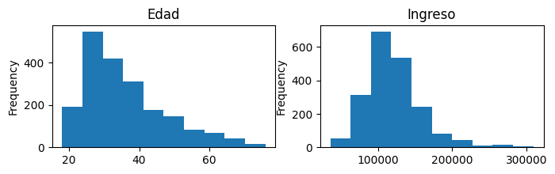
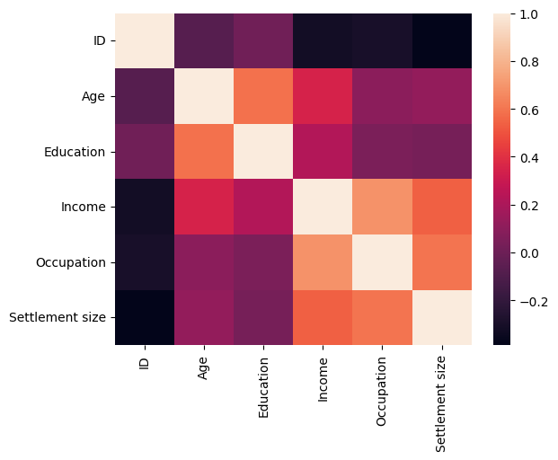
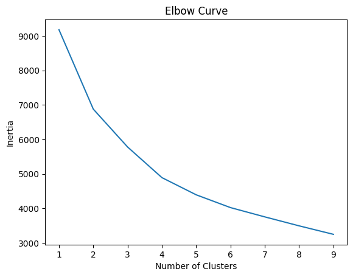
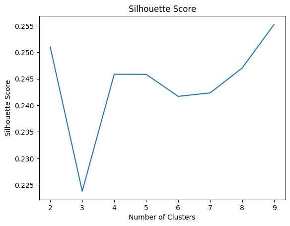
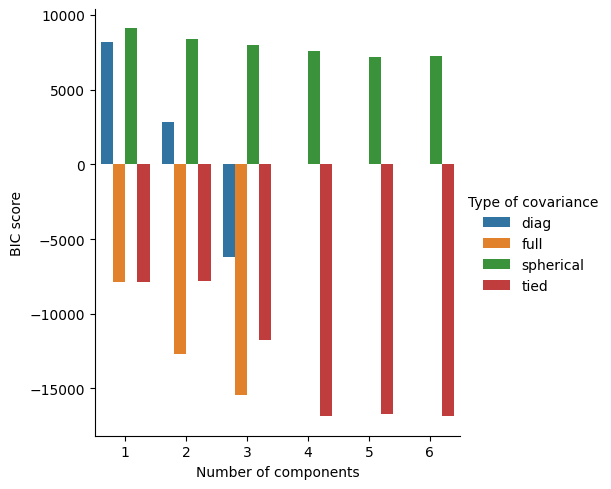
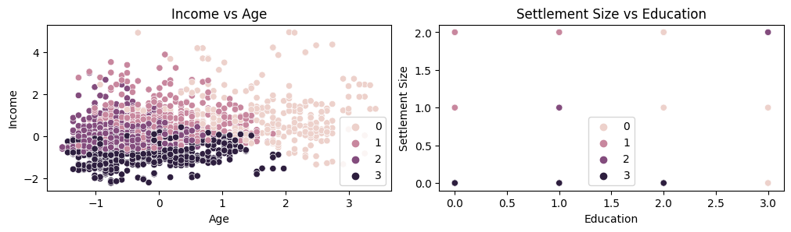

## Segmentación de Clientes

### Objetivo

El objetivo del presente trabajo es segmentar a los clientes de un supermercado en un número reducido de grupos, esto a partir de información obtenida a través de las tarjetas de membresía.

### Prerequisitos

Las librerias necesarias están listadas en requirements.txt. También se incluye environment.yml para los usuarios de Anaconda.

### Datos

El conjutno de datos proviene de Kaggle bajo el nombre de "Customer Clustering", el cual fue subido por Dev Sharma. Este cuenta con 2000 observaciones.

Ver la carpeta de referencias para más información.

### Exploración Inicial de Datos

El conjunto de datos se compone de variables numericas, ordinales y categoricas. La mayoria de los clientes se encuentra entre los 20 y 60 años y tienen ingresos medio-altos.

También, se puede observar que existe correlación entre ciertas variables numéricas. 

### Construcción del modelo
Tres algoritmos de agrupamiento distintos fueron implementados: K-means, HDBSCAN y Gaussian Mixture Model. En cada caso,  se determinaron los mejores hiper-parámetros. Se utilizó la biblioteca Scikit-learn para K-means y GMM, mientras que para el algoritmo HDBSCAN se utilizó la implementación provista por la biblioteca hdbscan.

Se utilizaron varias técnicas para la selección de los hiperparámetros para cada algoritmo.

- Para K-means se utilizó una combinación entre el método del codo (elbow curve) que usa la métrica inercia, y la métrica de la silueta.

 

- Para HDBSCAN se utilizó la métrica de la silueta.
- Para GMM se utilizó la métrica BIC (Bayesian Information Criterion) junto con la métrica score para escoger los valor más óptimos.

### Selección del modelo

A continuación se ilustra los resultados de cada uno de los modelos.

De la anterior gráfica, se escoje el algoritmo K-mean con K=4, cuatro grupos. Su desempeño es bueno y tiene un "reducido" número de grupos. 

### Resultados del Modelo

Se realiza una inspección visual de los resultados de este algoritmo.

 

 
  

### Conclusiones

El modelo que mejor se desempeña con la métrica escogida es el de arquitectura más simple. Sin embargo, todavía es posible mejorar este modelo buscando hiperparámetros más óptimos realizando una busqueda exaustiva con "Grid Search".

### Contacto

jimenezc.bo@gmail.com  

jimenezc.antn@gmail.com

