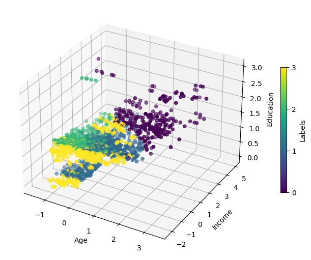
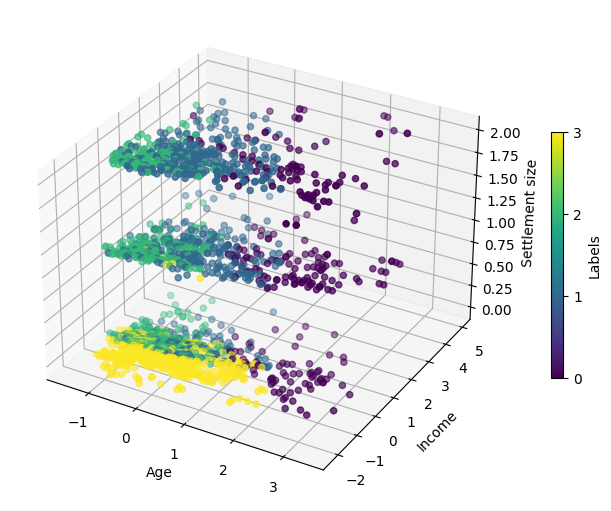

## Customer Segmentation

English | [Español](README_es.md)

### Objective

The objective of this work is to segment supermarket customers into a reduced number of groups based on information obtained through membership cards.

### Prerequisites

The necessary libraries are listed in requirements.txt. An environment.yml file is also included for Anaconda users.

### Data

The dataset comes from Kaggle under the name "Customer Clustering," uploaded by Dev Sharma. It consists of 2000 observations.

Refer to the references folder for more information.

### Initial Data Exploration

The dataset consists of numerical, ordinal, and categorical variables. Most of the customers are between 20 and 60 years old and have medium to high incomes.

Additionally, there is correlation between certain numerical variables.

### Model Building

Three different clustering algorithms were implemented: K-means, HDBSCAN, and Gaussian Mixture Model (GMM). In each case, the best hyperparameters were determined. The Scikit-learn library was used for K-means and GMM, while the HDBSCAN algorithm was implemented using the hdbscan library.

Various techniques were used for hyperparameter selection for each algorithm.

- For K-means, a combination of the elbow method using the inertia metric and the silhouette metric was used.

 

- For HDBSCAN, the silhouette metric was used.
- For GMM, the BIC (Bayesian Information Criterion) metric, along with the score metric, was used to choose the most optimal values.

### Model Selection

Below are the results of each of the models.

From the above graph, the K-means algorithm with K=4, four groups, is chosen. Its performance is good, and it has a "reduced" number of groups.

### Model Results

A visual inspection of the results of this algorithm is conducted, considering variables in pairs and in triples. This provides some insight into how the data is being grouped.

 

### Conclusions

K-means is the model that performs best with this data and the requirement of having a "small" number of groups. However, it is still possible to improve this model by exhaustively searching for more optimal hyperparameters.

### Contact

[LinkedIn](https://www.linkedin.com/in/antonio-jimnzc/)
